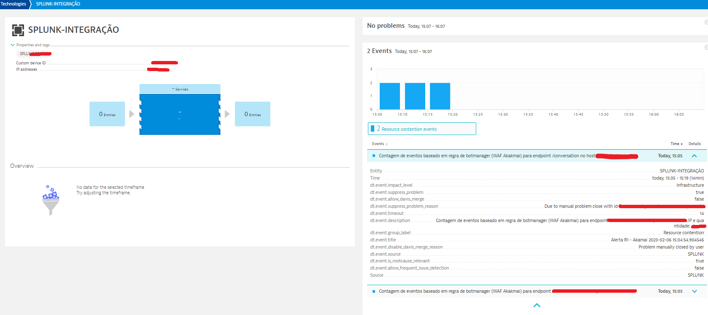

# Introdução

Pessoal, recentemente elaborei a primeira versão de uma integração entre as ferramentas Splunk e Dynatrace para compartilhamento de alertas entre equipes. Foi uma necessidade de cliente, a integração ainda não existia open-source e não houve êxito instalando add-on para realizar requisições/webhook via post com json.
A princípio a integração não conta com sua versão add-on Splunk que possibilita instalação via interface web do Splunk, porém futuramente será adaptado.

O principal objetivo da integração seria manter informada a equipe que visualiza a ferramenta Dynatrace quando surgir um alerta no Splunk sem a necessidade de estar acessando ambas as ferramentas. Após avaliado os dados e emitido o alerta na interface web do Splunk, deveria também aparecer no Dynatrace utilizando o recurso Custom Device (semelhante à alertas do Splunk).

Para quem não conhece o [Splunk](https://www.splunk.com/en_us/blog/learn/what-splunk-does.html), é uma solução big data utilizada para consumir grande quantidade de dados, avaliá-los e orquestrar ações, como por exemplo enviar alertas, emails, mensagens ao Slack, emitir relatórios ou gerar dashboards. E no caso da equipe que pertenço, é utilizado como ferramenta de [SIEM](https://www.microsoft.com/pt-br/security/business/security-101/what-is-siem) (Security Event Manager).
Já o [Dynatrace](https://www.dynatrace.com/solutions/application-monitoring/) serve para monitoramento da pilha completa da aplicação, desde o front-end, experiência do usuário, até a infraestrutura de back-end para fornecer visibilidade completa do desempenho do aplicativo.

O alerta utilizado como caso de uso para a integração, analisa dados originados do Akamai WAF em relação ao alto consumo para um endpoint específico. Após a análise, emite um alerta, ou seja, muitas requisições chegando, indicando um possível ataque de enumeração ou força bruta que deverá ser compartilhado/informado.

# Configuração
Para inciar, é necessário ter conhecimento básico em criar alerta no Splunk e em interpretação de chamadas de API.
O alerta compartilhado segue o padrão abaixo, com o possível IP atacante e quantidade de requisições:
`0.0.0.0(IP): 5000(requisições)`

## Etapa 1 - Gerando Custom Device no Dynatrace
Para essa etapa, siga a [documentação](https://www.dynatrace.com/support/help/dynatrace-api/environment-api/topology-and-smartscape/custom-device-api) oficial. Ela te guiará para a geração da Chave de API e Device Name que serão utilizados posteriormente.

## Etapa 2 - Transferindo arquivo de integração para servidor Splunk
Salve o script em `/opt/splunk/bin/scripts` com permissão de leitura e pertencente ao usuário Splunk.

Permissão:
`chmod +x integracao.py`

Transferir dono:
`chown splunk:splunk integracao.py`

## Etapa 3 - Geração de arquivo csv após alerta
Enquanto criando um alerta para o Splunk, adicione a ação Saída de Arquivo .csv com a opção Replace, para que apenas novos alertas permaneçam no arquivo:

## Etapa 4 - ajustando arquivo de integração
É necessário alterar as funções payloadCreator() e requester() da classe Sender e o apontamento para o arquivo .csv gerado pelo alerta na função main() de acordo com seu ambiente:

## Etapa 5 - Apontando integração em alerta
Adicione a ação para executar scripts no servidor:

# Validação de alerta compartilhado
O alerta será gerado no Custom Devices:

